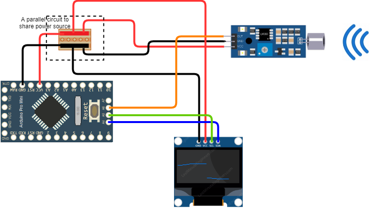

<!DOCTYPE html>
<html>
    <head>
    </head>
    <body>
        <h1>Sound sensor with display</h1>
        Arduino
        C++
        In-Development
        
Fancy to be supernatural investagator/ghostbuster? Detect paranormal activity (lol) with this sound sensor! Sound intensity will be displayed as graph so you know which direction has the most noise

        Materials:
        <ul><li>Arduino pro mini</li>
        <li>FTDI programmer (to program pro mini)</li>
        <li>Sound sensor (FC-04)</li>
        <li>SSD1306 display</li>
        <li>A parallel circuit</li>
        </ul>
        Connection:   
        
    </body>
</html>